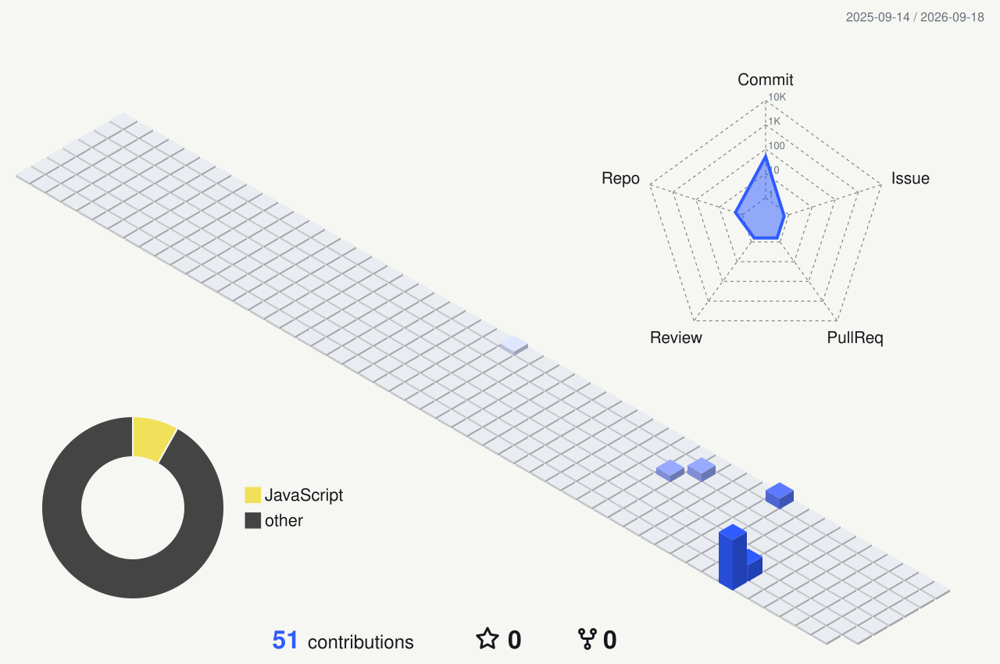

  <picture>
    <source media="(max-width: 600px)" srcset="./assets/field-system-mobile.svg" />
    
  </picture>

  
  
  
  

  

<picture>
  <source media="(prefers-color-scheme: dark)" srcset="./profile-3d-contrib/field-night.svg" />
  
</picture>

  
<b>PROFILE INDEX / accessible text</b>

   

  **Go Woo Suk** — Game Engineer · Undergraduate Researcher

  - B.S. Computer Engineering, 3rd year — Incheon National University
  - Undergraduate Researcher — Entertainment Computing Lab (ECL)
  - Teaching Assistant — Entertainment Software
  - Focus — Game AI, NPC systems, real-time interaction, AR, and computer vision
  - Core — C, C++, Python, Java, JavaScript, MATLAB, Unreal Engine 5
  - Tools — OpenCV, Unity, Git, Docker, Rider, Visual Studio

  **Recognition & publication**

  - 한국게임학회 2025 추계 학술발표대회 — 우수논문상
  - 한국게임학회 2026 춘계 학술발표대회 — 우수논문상
  - 한국게임학회 논문지 2026년 10월호 — KCI 게재 예정

  논문 제목과 연구 세부 내용은 공개 범위에서 제외했습니다.

  
<b>OFF THE CLOCK</b>

   
  Digital illustration · Rhythm games · F1 telemetry · PC building &amp; workspace design

