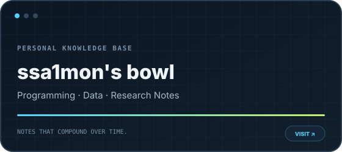

 

## Player profile

<table>
<tr>
<td width="50%" valign="top">
<h3>👋 Hello, I'm Go Woo Suk</h3>

게임을 만들고, 게임 속 지능형 시스템을 연구하는 컴퓨터공학 학부생입니다. <strong>게임플레이 구현과 연구 프로토타이핑</strong>을 오가며 아이디어를 실제로 동작하는 시스템으로 바꾸는 과정에 관심이 있습니다.

<code>Game Engineering</code> <code>Game AI</code> <code>Real-time Systems</code> <code>AR / CV</code>

</td>
<td width="25%" valign="top">
<h3>🎓 Education</h3>

<strong>Incheon National University</strong>

B.S. Computer Engineering 3rd-year undergraduate

</td>
<td width="25%" valign="top">
<h3>🔬 Research</h3>

<strong>Entertainment Computing Lab</strong>

Undergraduate Researcher Entertainment Software TA

</td>
</tr>
</table>

<table>
<tr>
<td width="33%" valign="top">
<h3>🎮 Build</h3>

Unreal Engine 5와 C++를 중심으로 게임플레이, NPC AI, 실시간 시뮬레이션 시스템을 구현합니다.

</td>
<td width="34%" valign="top">
<h3>🧪 Research</h3>

게임 AI와 AR/CV 주제를 실험 가능한 프로토타입으로 만들고, 데이터로 검증하는 과정에 집중합니다.

</td>
<td width="33%" valign="top">
<h3>📝 Document</h3>

개발과 연구 과정에서 얻은 지식을 개인 웹사이트에 정리하며, 다시 활용할 수 있는 기록으로 남깁니다.

</td>
</tr>
</table>

## Recognition & publication

<table>
<tr>
<td width="15%" align="center"><h2>2025</h2>FALL</td>
<td valign="middle"><strong>한국게임학회 2025 추계 학술발표대회</strong> Korean Game Society Fall Conference</td>
<td width="24%" align="center"></td>
</tr>
<tr>
<td align="center"><h2>2026</h2>SPRING</td>
<td valign="middle"><strong>한국게임학회 2026 춘계 학술발표대회</strong> Korean Game Society Spring Conference</td>
<td align="center"></td>
</tr>
<tr>
<td align="center"><h2>2026</h2>OCTOBER</td>
<td valign="middle"><strong>한국게임학회 논문지 2026년 10월호</strong> KCI-listed Journal · scheduled publication</td>
<td align="center"></td>
</tr>
</table>

※ 공개 가능한 학회·수상·게재 정보만 표시하며, 논문 제목과 연구 세부 내용은 제외합니다.

## Technical inventory

<table>
<tr>
<td width="50%" valign="top">
<h3>⚙️ Systems & gameplay</h3>

<strong>Main lane.</strong> 게임플레이 코드, NPC 로직, 엔진 기반 실시간 시스템 구현에 사용합니다.

</td>
<td width="50%" valign="top">
<h3>🔎 Research & analysis</h3>

연구 프로토타이핑, 실험 자동화, 수치 분석, AR·컴퓨터 비전 작업에 사용합니다.

</td>
</tr>
<tr>
<td valign="top">
<h3>🧩 Application development</h3>

컴퓨터공학 학습, 애플리케이션 구현, 개인 웹사이트와 인터랙티브 도구 제작에 사용합니다.

</td>
<td valign="top">
<h3>🧰 Workflow & supporting tools</h3>

버전 관리, 재현 가능한 개발 환경, 엔진·IDE 기반 구현을 보조하는 도구들입니다.

</td>
</tr>
</table>

## Current coordinates

<table>
<tr>
<td width="34%" valign="top">
<h3>NOW · Engineering</h3>

실시간 환경에서 자연스럽게 반응하고 협동하는 NPC 시스템을 구현합니다.

</td>
<td width="33%" valign="top">
<h3>NOW · Research</h3>

Game AI를 중심으로 AR·Computer Vision까지 엔터테인먼트 컴퓨팅의 접점을 탐구합니다.

</td>
<td width="33%" valign="top">
<h3>NEXT · Direction</h3>

기술적으로 탄탄하면서도 플레이어에게 실제 감정을 남기는 게임을 만들고 싶습니다.

</td>
</tr>
</table>

## Online basecamp

<table>
<tr>
<td width="50%" valign="middle">
<h3><a href="https://ssa1mon.vercel.app">ssa1mon's bowl ↗</a></h3>

<strong>Programming · Data · Research Notes</strong>

완성된 결과만이 아니라 개발과 학습의 과정을 축적하는 개인 지식 저장소입니다.

</td>
<td width="50%" align="center">

</td>
</tr>
</table>

## GitHub telemetry

<picture>
  <source media="(prefers-color-scheme: dark)" srcset="https://github-profile-summary-cards.vercel.app/api/cards/profile-details?username=ssa1monn&theme=github_dark" />
  
</picture>

<picture>
  <source media="(prefers-color-scheme: dark)" srcset="https://github-profile-summary-cards.vercel.app/api/cards/stats?username=ssa1monn&theme=github_dark" />
  
</picture>
<picture>
  <source media="(prefers-color-scheme: dark)" srcset="https://streak-stats.demolab.com?user=ssa1monn&hide_border=true&background=00000000&ring=53D3FF&fire=C4F16B&currStreakLabel=53D3FF&sideLabels=8B949E&dates=8B949E&currStreakNum=F0F6FC&sideNums=F0F6FC" />
  
</picture>

<picture>
  <source media="(prefers-color-scheme: dark)" srcset="https://github-profile-summary-cards.vercel.app/api/cards/repos-per-language?username=ssa1monn&theme=github_dark" />
  
</picture>
<picture>
  <source media="(prefers-color-scheme: dark)" srcset="https://github-profile-summary-cards.vercel.app/api/cards/most-commit-language?username=ssa1monn&theme=github_dark" />
  
</picture>
<picture>
  <source media="(prefers-color-scheme: dark)" srcset="https://github-profile-summary-cards.vercel.app/api/cards/productive-time?username=ssa1monn&theme=github_dark&utcOffset=9" />
  
</picture>

<picture>
  <source media="(prefers-color-scheme: dark)" srcset="https://github-readme-activity-graph.vercel.app/graph?username=ssa1monn&bg_color=00000000&color=8b949e&line=53d3ff&point=c4f16b&area=true&area_color=53d3ff&hide_border=true" />
  
</picture>

<strong>Off duty — the person outside the lab</strong>

 

- 🎨 Digital illustration — character art & DJMAX fan art
- 🎵 Rhythm games, especially DJMAX
- 🏎️ F1 & motorsport data — telemetry visualization is the dream side quest
- 🖥️ PC building & workspace customization

---

<strong>BUILD · RESEARCH · DOCUMENT · REPEAT</strong>

 Making games that feel alive.

