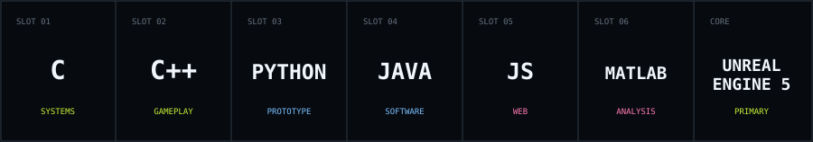
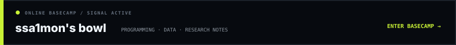

<p align="center">
  
</p>

<p align="center">
  <samp>
    <a href="https://ssa1mon.vercel.app">[ WEBSITE ]</a>
    &nbsp;·&nbsp;
    <a href="https://www.instagram.com/ssa1mon_">[ INSTAGRAM / @ssa1mon_ ]</a>
    &nbsp;·&nbsp;
    <a href="https://x.com/ssa1mon_">[ X / @ssa1mon_ ]</a>
    &nbsp;·&nbsp;
    <a href="mailto:ssa1mon@inu.ac.kr">[ EMAIL ]</a>
  </samp>
</p>

<table>
  <tr>
    <td width="58%" valign="top">
      <h3>PLAYER PROFILE</h3>
      I build games and the intelligent systems inside them. My work connects <b>gameplay engineering</b> with <b>research prototyping</b>—turning ideas into systems that can be played, measured, and improved.
      <br/><br/>
      <code>GAME AI</code> <code>NPC SYSTEMS</code> <code>REAL-TIME</code> <code>AR / CV</code>
    </td>
    <td width="42%" valign="top">
      <h3>STATUS</h3>
      <code>NAME</code>&nbsp;&nbsp; Go Woo Suk<br/>
      <code>CLASS</code>&nbsp; Game Engineer / Researcher<br/>
      <code>BASE</code>&nbsp;&nbsp; Incheon National University<br/>
      <code>LAB</code>&nbsp;&nbsp;&nbsp; Entertainment Computing Lab<br/>
      <code>ROLE</code>&nbsp;&nbsp; Undergraduate Researcher · TA
    </td>
  </tr>
</table>

## `// ACTIVE LOADOUT`



<p align="center">
  
  
  
  
  
  
</p>

## `// RESEARCH FILE`

| Channel | Current coordinates |
| --- | --- |
| `EDUCATION` | B.S. Computer Engineering · 3rd year · Incheon National University |
| `LAB` | Entertainment Computing Lab (ECL) · Undergraduate Researcher |
| `TEACHING` | Teaching Assistant · Entertainment Software |
| `ENGINEERING` | Gameplay systems · responsive NPC behavior · real-time interaction |
| `RESEARCH` | Game AI · augmented reality · computer vision |

## `// ACHIEVEMENT LOG`

| ID | Event | Unlock |
| :---: | --- | --- |
| `A-01` | 한국게임학회 2025 추계 학술발표대회 | **우수논문상** |
| `A-02` | 한국게임학회 2026 춘계 학술발표대회 | **우수논문상** |
| `P-01` | 한국게임학회 논문지 2026년 10월호 | **KCI 게재 예정** |

<sub>논문 제목과 연구 세부 내용은 공개 범위에서 제외했습니다.</sub>

## `// CURRENT QUESTS`

```text
01  ENGINEERING    Build responsive NPC behavior and robust real-time systems
02  RESEARCH       Explore the intersections of game AI, AR, and computer vision
03  DIRECTION      Create technically solid games that leave an emotional trace
```

<a href="https://ssa1mon.vercel.app">
  
</a>

## `// LIVE SIGNAL`


<details>
  <summary><b>EXPAND TELEMETRY</b></summary>
  <br/>
  <p align="center">
    
    
    
  </p>
</details>

<details>
  <summary><b>OPEN SIDE QUESTS</b></summary>
  <br/>
  Digital illustration · Rhythm games · F1 telemetry · PC building &amp; workspace design
</details>

<p align="center"><samp>— END OF SAVE FILE —</samp></p>


