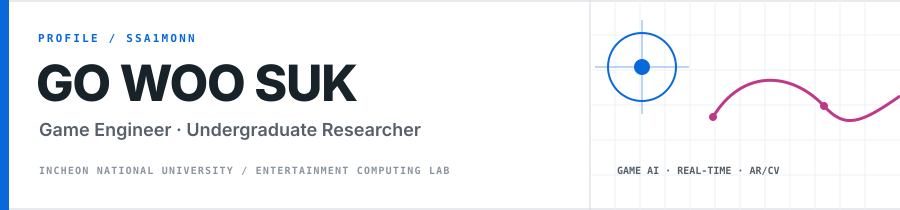

  

  <samp>
    <a href="https://ssa1mon.vercel.app">portfolio</a> ·
    <a href="https://www.instagram.com/ssa1mon_">instagram / @ssa1mon_</a> ·
    <a href="https://x.com/ssa1mon_">x / @ssa1mon_</a> ·
    <a href="mailto:ssa1mon@inu.ac.kr">email</a>
  </samp>

I build games and the intelligent systems inside them. My work moves between gameplay engineering and research prototyping—turning ideas about **NPC AI, real-time interaction, AR, and computer vision** into systems that can be played, tested, and improved.

<table>
  <tr>
    <td width="50%" valign="top">
      <h3>Identity</h3>
      <b>Go Woo Suk</b> 
      Game Engineer · Undergraduate Researcher  
      B.S. Computer Engineering, 3rd year 
      Incheon National University
    </td>
    <td width="50%" valign="top">
      <h3>Research &amp; teaching</h3>
      Entertainment Computing Lab (ECL) 
      Undergraduate Researcher  
      Teaching Assistant 
      Entertainment Software
    </td>
  </tr>
</table>

## Recognition

| Year | Record | Result |
| :---: | --- | --- |
| 2025 | 한국게임학회 2025 추계 학술발표대회 | **우수논문상** |
| 2026 | 한국게임학회 2026 춘계 학술발표대회 | **우수논문상** |
| 2026 | 한국게임학회 논문지 2026년 10월호 | **KCI 게재 예정** |

논문 제목과 연구 세부 내용은 공개 범위에서 제외했습니다.

## Technical stack

**Primary languages**

**Engine &amp; research computing**

**Workflow**

## Current direction

> **Engineering** — responsive NPC behavior and robust real-time gameplay systems  
> **Research** — intersections of game AI, AR, and computer vision  
> **Long term** — technically solid games that leave a real emotional impression

## GitHub activity

  
<b>Open GitHub telemetry</b>

   
  

    
    
    
  

  
<b>Off the clock</b>

   
  Digital illustration · Rhythm games · F1 telemetry · PC building &amp; workspace design

